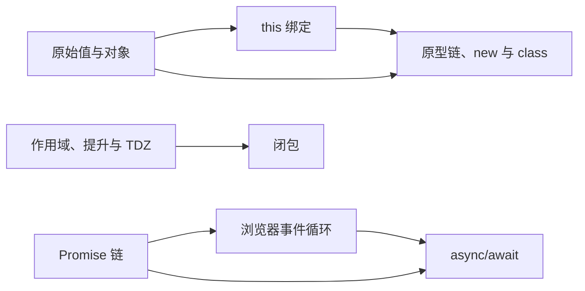

# JavaScript 学习索引

最后更新：2026-08-25

## 本批目标

首批 8 道题用于建立 JavaScript 的两条核心知识链：语言基础与对象模型、Promise 与浏览器异步调度。所有题目均为 `P0`，建议按顺序学习，不要只背输出结果。

## 知识依赖

## 推荐顺序

| 顺序 | 题目 | 难度 | 优先级 | 状态 | 学习重点 |
| --- | --- | --- | --- | --- | --- |
| 1 | [[原始值与对象的赋值和传参]] | easy | P0 | new | 按值传递、对象身份、重新赋值与修改对象 |
| 2 | [[var-let-const-作用域提升与暂时性死区]] | medium | P0 | new | 绑定创建、初始化时机、块级作用域与 TDZ |
| 3 | [[闭包与词法作用域]] | medium | P0 | new | 捕获词法绑定、生命周期与异步回调 |
| 4 | [[this-绑定规则与箭头函数]] | medium | P0 | new | 调用位置、绑定优先级与 lexical `this` |
| 5 | [[原型链-new-与-class]] | hard | P0 | new | `[[Prototype]]` 查找、`new` 过程与 `class` 语义 |
| 6 | [[Promise-链与错误传播]] | medium | P0 | new | 链式返回、Promise resolution 与错误传播 |
| 7 | [[浏览器事件循环与任务调度]] | hard | P0 | new | task、microtask checkpoint 与渲染机会 |
| 8 | [[async-await-串并行与错误处理]] | medium | P0 | new | Promise 关系、串并行选择与错误边界 |

## 学习方法

1. 只看题目，先用 30 秒口述自己的答案。
2. 展开答案后检查结论、因果和边界，不按关键词机械对照。
3. 手动运行或改写示例，先预测结果，再解释每一步。
4. 用“常见追问”继续口述，并尝试关联 `my-ipaas` 的真实代码。
5. 完成一题后再进行评分和复习日期回写。

## 本批边界

- 尚未加入深浅拷贝、垃圾回收、模块系统、迭代器、生成器和 Proxy 等主题。
- `this` 与原型链在 `my-ipaas` 中只有辅助代码案例，不作为项目亮点。
- 异步题会引用项目现有实现与缺口；代码存在不代表小杜已经掌握。

