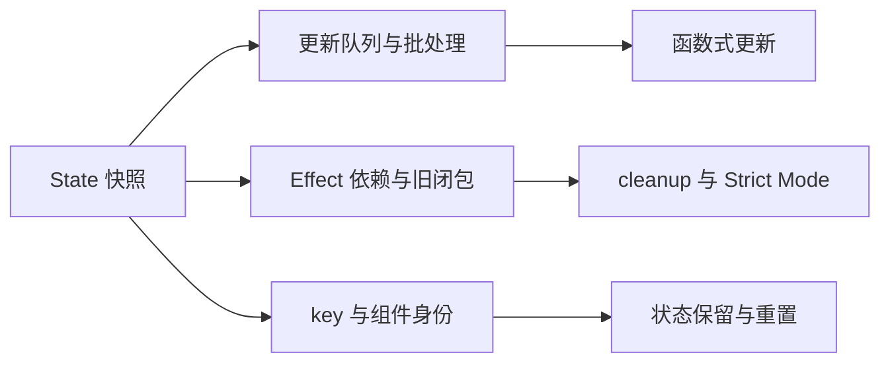

# React 学习索引

最后更新：2026-08-25

## 本批目标

首批 3 道题用于建立“渲染得到 State 快照 -> Effect 将结果与外部系统同步 -> 组件身份决定状态是否保留”的知识链。内容按 React 19.2 官方文档核验，优先服务现代函数组件与 Hooks 面试。

## 知识依赖

## 推荐顺序

| 顺序 | 题目 | 难度 | 优先级 | 状态 | 学习重点 |
| --- | --- | --- | --- | --- | --- |
| 1 | [[State-快照批处理与函数式更新]] | medium | P0 | new | 渲染快照、更新队列、不可变更新 |
| 2 | [[useEffect-依赖清理与StrictMode]] | hard | P0 | new | 外部同步、响应式依赖、对称清理 |
| 3 | [[key-组件身份与状态保留]] | medium | P0 | new | 稳定身份、列表重排、主动重置 |

## 学习方法

1. 先预测连续三次 setter 的结果，再解释旧值来自哪次渲染。
2. 写一个 Effect 前先说清楚它同步的外部系统；说不出来时重新判断是否需要 Effect。
3. 在 Strict Mode 下观察 setup -> cleanup -> setup，并验证没有残留监听器或请求写入。
4. 用带输入框 State 的列表对比稳定 ID 和索引 `key`，主动制造一次重排。
5. 走读 `my-ipaas` 后画出 State、Effect、递归步骤 ID 与拖拽 Provider 重建的数据流。

## 版本与项目边界

- React 官方资料核验于 2026-08-11，当日 `react.dev` 最新文档版本为 19.2；`my-ipaas` 声明 React 19.2.0。
- 本批不展开 Server Components、Suspense、Transitions、React Compiler 和框架级数据获取。
- 项目代码存在相关案例不等于老公已经掌握；当前 `npm run check` 仍有 18 个 lint 错误，lint 失败后 build 未执行。
