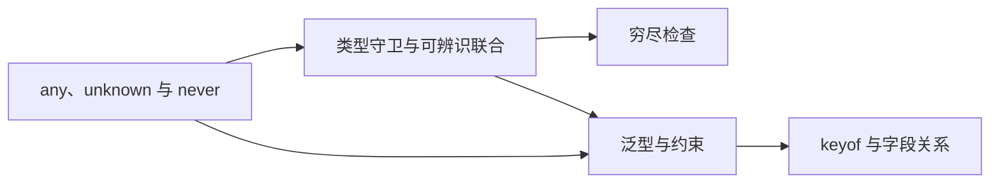

# TypeScript 学习索引

最后更新：2026-08-25

## 本批目标

首批 3 道题用于建立“安全接收未知值 -> 根据证据收窄 -> 用泛型表达类型关系”的基础链路。内容按 TypeScript 5.9.3 验证，重点不是记语法，而是能说明类型设计怎样减少真实业务中的无效状态和边界风险。

## 知识依赖

## 推荐顺序

| 顺序 | 题目 | 难度 | 优先级 | 状态 | 学习重点 |
| --- | --- | --- | --- | --- | --- |
| 1 | [[any-unknown-never-区别]] | medium | P0 | new | 安全边界、可赋值性与不可达状态 |
| 2 | [[类型守卫-可辨识联合与穷尽检查]] | medium | P0 | new | 控制流分析、业务状态建模与遗漏检测 |
| 3 | [[泛型约束-keyof-与类型关系]] | medium | P0 | new | 输入输出关系、最小约束与安全字段访问 |

## 学习方法

1. 先用自己的话说明三个类型各自“允许什么、禁止什么”，再展开答案。
2. 手写一个接收 `unknown` 的解析函数，不使用断言跳过校验。
3. 给步骤联合新增一个成员，观察穷尽检查如何产生编译错误。
4. 脱离原题写出 `K extends keyof T` 的字段读取函数，并解释返回值为什么是 `T[K]`。
5. 走读 `my-ipaas` 对应代码时区分“静态类型声明”和“运行时已经验证”。

## 本批边界

- 尚未系统展开工具类型、映射类型、条件类型、模板字面量类型和类型体操。
- 示例通过 TypeScript 5.9.3 检查，不代表所有结论只适用于 5.9。
- `my-ipaas` 中存在相关类型写法，但当前质量检查未通过，也不代表老公已能独立设计或实现。
