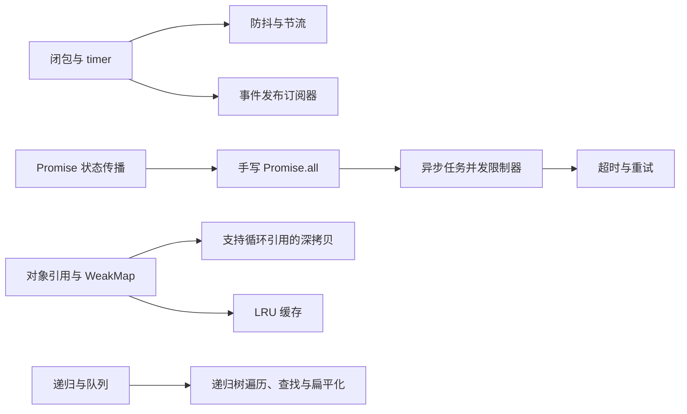

# 手写实现学习索引

最后更新：2026-09-23

## 本批目标

首批 8 道题聚焦中级前端常见的现场编码能力：先用闭包管理 timer 和对象引用，再进入 Promise 组合与并发控制，最后补齐事件、缓存和递归数据结构。主答案使用面试现场可写完的 JavaScript 核心实现，复杂的工程能力放在追问中口述。

## 知识依赖

## 推荐顺序

| 顺序 | 题目 | 难度 | 优先级 | 状态 | 学习重点 |
| --- | --- | --- | --- | --- | --- |
| 1 | [[1.防抖与节流实现|防抖与节流实现]] | medium | P1 | new | 闭包、timer 重置、时间戳节流与 `this` |
| 2 | [[2.支持循环引用的深拷贝|支持循环引用的深拷贝]] | hard | P1 | new | 对象图、重复引用、内建对象与能力边界 |
| 3 | [[3.Promise-all实现|Promise-all实现]] | medium | P1 | new | 输入顺序、完成计数和快速失败 |
| 4 | [[4.异步任务并发限制器|异步任务并发限制器]] | medium | P1 | new | 固定 worker、结果保序和失败停止调度 |
| 5 | [[5.异步任务超时与重试|异步任务超时与重试]] | medium | P1 | new | `Promise.race`、尝试次数与固定间隔 |
| 6 | [[6.事件发布订阅器|事件发布订阅器]] | medium | P1 | new | `Map + Set`、同步派发与 once 重入 |
| 7 | [[7.LRU缓存|LRU缓存]] | medium | P1 | new | `Map` 顺序、访问刷新和容量淘汰 |
| 8 | [[8.递归树遍历查找与扁平化|递归树遍历查找与扁平化]] | medium | P1 | new | DFS、BFS、递归深度与工作流步骤树 |

## 学习方法

1. 先只看题目，口述核心数据结构和两三个关键变量。
2. 限时 15–40 分钟手写主代码，再运行最小示例检查结果。
3. 主动修改需求，例如为防抖增加立即执行、为并发器增加取消，说明代码需要改在哪里。
4. 口述时先讲当前面试版的能力，再主动说明它和生产实现的差距。
5. 结合 `my-ipaas` 只读案例画出数据流；代码存在不代表已经掌握，仍需脱离原文件重写并测试。

## 本批边界

- 不重复建立完整的 `call`、`apply`、`bind`、`new` 和 `instanceof` 模拟题；相关机制已在 JavaScript 原理题中覆盖。
- 暂不收录完整 Promise、柯里化、函数组合、数组扁平化和虚拟 DOM 等扩展题。
- 所有主示例都使用 JavaScript，并且是面试训练用的明确子集，不包装成浏览器原生 API 或成熟库的完整替代品。
